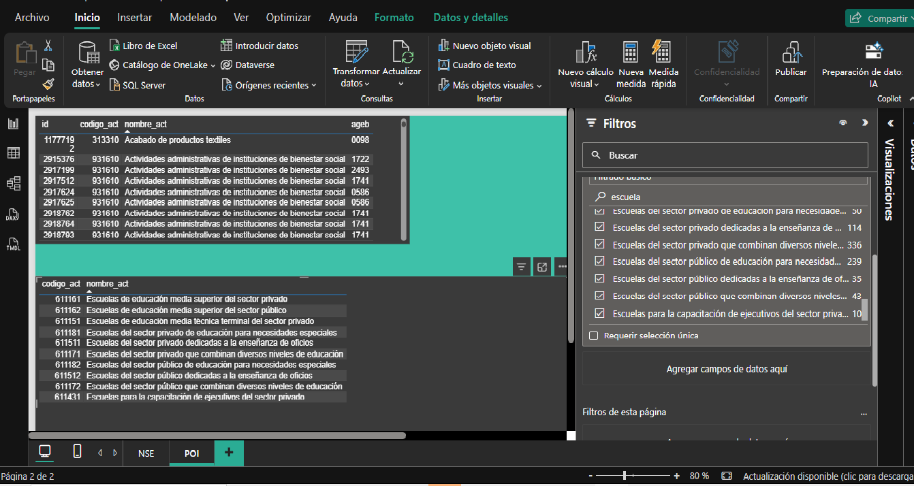

# Proyecto: Ubicación óptima para un restaurante de boneless en Monterrey, Nuevo León, México

---

## 1. Pregunta Principal del Proyecto

¿Qué zona del municipio de Monterrey presenta mayor potencial para abrir un restaurante de boneless rentable, considerando factores como:

- Afluencia de personas  
- Competencia  
- Nivel socioeconómico  

---

## 2. Justificación de la Pregunta

### 2.1 Importancia crítica de la ubicación

La ubicación es uno de los factores más determinantes para el éxito de un restaurante. Diversos análisis dentro de la industria gastronómica coinciden en que elegir un buen lugar impacta directamente en la rentabilidad y permanencia del negocio.

Sin el uso de datos, esta decisión se basa en suposiciones, lo que incrementa el riesgo operativo y financiero.  
El análisis de datos permite transformar una decisión intuitiva en una estrategia medible y fundamentada.

---

### 2.2 Justificación de los factores seleccionados

Los factores elegidos (afluencia, competencia y nivel socioeconómico) están respaldados por metodologías de análisis utilizadas en inteligencia de negocios.

La concentración geográfica de clientes y negocios permite identificar:

- Zonas con alta demanda  
- Zonas saturadas  
- Oportunidades de mercado  

---

## 3. Importancia de cada factor

### 3.1 Afluencia (demanda o flujo de personas)

El flujo de personas determina el tamaño del mercado disponible para un restaurante. Diversos estudios del sector indican que una parte importante de los ingresos proviene de consumidores ubicados en el área de influencia cercana al establecimiento.

Por esta razón, la afluencia constituye uno de los factores principales para evaluar el potencial comercial de una ubicación.

### Medición de la afluencia

Debido a la disponibilidad limitada de datos de tráfico peatonal real a nivel AGEB, la afluencia será estimada mediante la presencia de Puntos de Interés (POI) identificados dentro de cada zona geográfica.

Estos elementos actúan como generadores de movilidad y concentración de población, incrementando el potencial de consumo dentro de una determinada AGEB.

### Ponderación de Puntos de Interés (POI Weighting)

Con el objetivo de cuantificar la influencia de cada POI, se asigna una puntuación relativa a cada categoría de establecimiento.

## 3.2 Competencia 

La competencia representa la cantidad de negocios similares en una zona.

- Alta competencia → menor participación de mercado  
- Baja competencia → puede indicar oportunidad o baja demanda  

Conclusión:  
A mayor competencia, menor potencial de rentabilidad.

---

### 3.3 Nivel socioeconómico

El nivel socioeconómico define la capacidad de consumo de los clientes.

Para un restaurante de boneless (segmento casual), se requieren zonas con niveles:

- Medio  
- Medio-alto  

Conclusión:  
El nivel socioeconómico determina la viabilidad económica del negocio.

---

## 4. Análisis integral

Los factores deben analizarse en conjunto:

- Alta afluencia sin ingreso → bajo consumo  
- Alto ingreso sin flujo → pocos clientes  
- Alta competencia → menor participación  

El análisis conjunto reduce el riesgo y mejora la toma de decisiones.

Conclusión:

El uso combinado de los factores permite transformar la selección de ubicación en un proceso basado en datos.

---

## 5. Reglas de Negocio

Las siguientes reglas de negocio establecen los criterios utilizados para identificar las zonas con mayor potencial para la apertura de un restaurante de boneless en el municipio de Monterrey, Nuevo León.

### RN-01: Mercado Objetivo

El análisis se enfocará exclusivamente en AGEB cuyo nivel socioeconómico predominante corresponda a los niveles:

- C
- C+

#### Justificación

El concepto de restaurante de boneless se orienta principalmente a consumidores de nivel socioeconómico medio y medio-alto, segmentos que presentan una capacidad de gasto compatible con el tipo de producto y experiencia ofrecida.

---

### RN-02: Exclusión de AGEB fuera del mercado objetivo

Las AGEB cuya clasificación socioeconómica predominante corresponda a:

- A/B
- D+
- D
- E

serán excluidas del análisis principal.

#### Justificación

Estas zonas no representan el mercado objetivo prioritario definido para el proyecto.

---

### RN-03: Priorización de la afluencia potencial

Las AGEB que presenten una mayor concentración de puntos generadores de afluencia recibirán una puntuación superior dentro del modelo de evaluación.

Se consideran los siguientes generadores de afluencia:

- Escuelas
- Universidades
- Hospitales
- Centros comerciales

#### Justificación

La presencia de estos establecimientos incrementa la movilidad de personas y el mercado potencial disponible para el restaurante.

---

### RN-04: Priorización del perfil de cliente objetivo

Dentro de los generadores de afluencia, se otorgará mayor relevancia a:

- Centros comerciales
- Universidades
- Escuelas

respecto a los hospitales.

#### Justificación

El mercado objetivo de un restaurante de boneless está compuesto principalmente por jóvenes y adultos jóvenes que realizan actividades recreativas, sociales y de consumo. Las universidades, escuelas y centros comerciales concentran una mayor proporción de este perfil de consumidor.

---

### RN-05: Penalización por competencia

Las AGEB que presenten una alta concentración de establecimientos similares recibirán una menor puntuación dentro del modelo de evaluación.

Se consideran competidores directos los negocios relacionados con:

- Boneless
- Alitas
- Wings
- Sports Bar
- Conceptos similares

#### Justificación

Una mayor presencia de competidores reduce la participación potencial de mercado y puede afectar la rentabilidad del establecimiento.

---

### RN-06: Evaluación integral de ubicación

La recomendación final de ubicación no dependerá de una única variable, sino de la combinación de:

- Nivel socioeconómico
- Afluencia potencial
- Competencia

#### Justificación

La evaluación conjunta permite reducir el riesgo de seleccionar zonas con alto poder adquisitivo pero baja afluencia, o zonas con alta afluencia pero excesiva competencia.

---

### RN-07: Ranking de zonas potenciales

Las AGEB analizadas serán ordenadas de acuerdo con una puntuación final obtenida a partir de los criterios definidos en el proyecto.

El resultado esperado será un ranking de las zonas con mayor potencial para la apertura de un restaurante de boneless.

#### Justificación

La generación de un ranking facilita la comparación objetiva entre ubicaciones y permite identificar las mejores oportunidades de negocio dentro del municipio de Monterrey.

## 6. Análisis de Nivel Socioeconómico (ETL)

Este proyecto incorpora datos reales de nivel socioeconómico mediante un proceso ETL.

---

## 6.1 Fuente de datos

Datos obtenidos de:

https://www.amai.org/NSE/index.php?queVeo=NSEDES  

Basados en:
- INEGI (ENIGH + Censo 2020)  
- Modelos de clasificación socioeconómica  

Nivel de detalle:
- Municipio  
- Localidad  
- AGEB  

---

## 6.2 Flujo de trabajo (ETL)

### Extract (Obtención)

Datos descargados en formato Shapefile:

- .shp → geometría  
- .dbf → atributos  
- .shx → índice  

---

### Transform (Python)

Se extrajeron los datos del archivo .dbf y se convirtieron a formato CSV utilizando Python.

Resultado:
- Conversión de DBF a CSV  
- Preparación de datos para análisis en Power BI  

---

### Load (Power BI)

El archivo CSV fue importado en Power BI para su análisis.

---

### Transform (Power BI / Power Query)

En Power BI se realizó la limpieza y transformación de datos, incluyendo:

- Eliminación de valores nulos  
- Corrección de tipos de datos  
- Estandarización de nombres  
- Selección de variables relevantes  

Resultado:
- Dataset limpio y estructurado para análisis  

---

## 6.3 Visualización preliminar de NSE en Power BI

Como resultado del proceso de limpieza y transformación de datos, se generaron visualizaciones iniciales para explorar el nivel socioeconómico por municipio.

### Distribución del nivel socioeconómico por municipio

Esta visualización muestra la distribución de los niveles socioeconómicos por municipio, permitiendo identificar las zonas con mayor presencia de niveles medios y altos, lo cual es clave para evaluar el potencial de consumo en el análisis de ubicación del restaurante.

# 7. Análisis de Puntos de Interés (ETL)

Este proyecto incorpora información de Puntos de Interés (POI) obtenida del Directorio Estadístico Nacional de Unidades Económicas (DENUE) de INEGI.

El objetivo es identificar establecimientos con capacidad de generar una "afluencia" potencial de personas y utilizarlos como una aproximación al potencial comercial de cada AGEB.

> **Nota:** En este proyecto el término "afluencia" hace referencia a una estimación indirecta del potencial de concentración de personas dentro de una AGEB, calculada a partir de la presencia y ponderación de Puntos de Interés (POI). No corresponde a una medición directa de tráfico peatonal.

---

## 7.1 Fuente de datos

Datos obtenidos de:

https://www.inegi.org.mx/app/mapa/denue/

Fuente oficial:

- Instituto Nacional de Estadística y Geografía (INEGI)
- Directorio Estadístico Nacional de Unidades Económicas (DENUE)

El DENUE proporciona información de establecimientos económicos registrados en México, incluyendo:

- Nombre del establecimiento
- Actividad económica
- Código de actividad económica (SCIAN)
- Ubicación geográfica
- Coordenadas
- Información territorial

---

## 7.2 Flujo de trabajo (ETL)

### Extract (Obtención)

Se descargó la base de datos del DENUE correspondiente al área geográfica de estudio.

Las variables utilizadas fueron:

- Nombre del establecimiento
- Código SCIAN
- Descripción de la actividad económica
- Coordenadas geográficas
- Clave AGEB

**Resultado:**

- Base de establecimientos económicos georreferenciados.

---

### Transform (Selección de POI)

La base original del DENUE contiene miles de actividades económicas con distintos niveles de relevancia para el análisis.

Debido a que el objetivo del proyecto es identificar zonas con potencial para la apertura de un restaurante de boneless, se seleccionaron únicamente aquellas actividades consideradas generadoras de "afluencia" potencial.

La selección fue realizada utilizando los códigos SCIAN de cada establecimiento.

Las categorías consideradas fueron:

**PENDIENTE**

**Resultado:**

- Dataset conformado exclusivamente por establecimientos relevantes para el análisis.

---

### Transform (Ponderación de POI)

Una vez identificados los establecimientos relevantes, se implementó una metodología de **Ponderación de Puntos de Interés (POI Weighting)**.

Cada categoría recibió una puntuación relativa basada en su capacidad estimada para atraer y concentrar población con potencial de consumo.

Estos valores representan un nivel de influencia relativo dentro del modelo y no una cantidad absoluta de personas.

Como resultado de este proceso, cada establecimiento obtuvo un valor de influencia asociado a su categoría económica.

**Resultado:**

- Asignación de un peso de influencia a cada POI seleccionado.

images/PonderacionPOI.png

---

### Transform (Agregación por AGEB)

Posteriormente, los establecimientos fueron agrupados utilizando la clave AGEB.

Para cada AGEB se calculó un **Índice de Influencia Comercial** mediante la suma de los pesos de todos los POI localizados dentro de la zona.

La fórmula utilizada fue:

Índice de Influencia Comercial AGEB =
Σ(Peso de cada POI ubicado en la AGEB)

**Resultado:**

- Generación de un score de influencia comercial para cada AGEB.

---

### Load (Power BI)

Los resultados fueron cargados en Power BI para su visualización y análisis.

Posteriormente se realizaron:
**PENDIENTE**
- Tablas comparativas entre AGEB
- Mapas geográficos
- Ranking de zonas
- Integración con datos de nivel socioeconómico AMAI

**Resultado:**

- Dataset consolidado para el análisis de potencial comercial.

---

## Resultado del proceso

El proceso ETL permitió transformar miles de establecimientos económicos del DENUE en un indicador cuantitativo de "afluencia" potencial.

Mediante la selección, ponderación y agregación de Puntos de Interés (POI) se construyó un Índice de Influencia Comercial por AGEB.

Este índice no representa una medición directa del flujo peatonal real, sino una estimación de la "afluencia" potencial generada por la presencia de establecimientos capaces de atraer y concentrar población dentro de una zona geográfica determinada.

El Índice de Influencia Comercial será utilizado posteriormente junto con las variables de nivel socioeconómico para identificar las zonas con mayor potencial para la apertura de un restaurante de boneless.
