# Proyecto: Ubicación óptima para un restaurante de boneless en Monterrey, Nuevo León, México

---

## 1. Pregunta Principal del Proyecto

¿Qué zona del municipio de Monterrey presenta mayor potencial para abrir un restaurante de boneless rentable, considerando factores como:

- Afluencia de personas  
- Competencia  
- Nivel socioeconómico  

---

## 2. Justificación de la Pregunta

### 2.1 Importancia crítica de la ubicación

La ubicación es uno de los factores más determinantes para el éxito de un restaurante. Diversos análisis dentro de la industria gastronómica coinciden en que elegir un buen lugar impacta directamente en la rentabilidad y permanencia del negocio.

Sin el uso de datos, esta decisión se basa en suposiciones, lo que incrementa el riesgo operativo y financiero.  
El análisis de datos permite transformar una decisión intuitiva en una estrategia medible y fundamentada.

---

### 2.2 Justificación de los factores seleccionados

Los factores elegidos (afluencia, competencia y nivel socioeconómico) están respaldados por metodologías de análisis utilizadas en inteligencia de negocios.

La concentración geográfica de clientes y negocios permite identificar:

- Zonas con alta demanda  
- Zonas saturadas  
- Oportunidades de mercado  

---

## 3. Importancia de cada factor

---

### 3.1 Afluencia (demanda o flujo de personas)

El flujo de personas determina el tamaño del mercado disponible para un restaurante. Diversos estudios del sector indican que una parte importante de los ingresos proviene de consumidores ubicados en el área de influencia cercana al establecimiento.

Por esta razón, la afluencia constituye uno de los factores principales para evaluar el potencial comercial de una ubicación.

#### Medición de la afluencia

Debido a la disponibilidad limitada de datos de tráfico peatonal real a nivel AGEB, la afluencia será estimada mediante la presencia de Puntos de Interés (POI) identificados dentro de cada zona geográfica.

Estos elementos actúan como generadores de movilidad y concentración de población, incrementando el potencial de consumo dentro de una determinada AGEB.

#### Ponderación de Puntos de Interés (POI Weighting)

Con el objetivo de cuantificar la influencia de cada POI, se asigna una puntuación relativa a cada categoría de establecimiento.

---

### 3.2 Competencia 

La competencia representa la cantidad de negocios similares en una zona.

- Alta competencia → menor participación de mercado  
- Baja competencia → puede indicar oportunidad o baja demanda  

Conclusión:  
A mayor competencia, menor potencial de rentabilidad.

---

### 3.3 Nivel socioeconómico

El nivel socioeconómico define la capacidad de consumo de los clientes.

Para un restaurante de boneless (segmento casual), se requieren zonas con niveles:

- Medio  
- Medio-alto  

Conclusión:  
El nivel socioeconómico determina la viabilidad económica del negocio.

---

## 4. Análisis integral

Los factores deben analizarse de manera conjunta, ya que cada uno aporta una perspectiva diferente sobre el potencial comercial de una ubicación:

- Alta afluencia sin ingreso → bajo consumo potencial.
- Alto ingreso sin flujo → menor captación de clientes.
- Alta competencia → menor participación de mercado.

Para integrar estos factores dentro de un mismo entorno analítico, se implementó una arquitectura de modelado dimensional basada en la metodología **Star Schema (Modelo Estrella)**. Esta estructura permite organizar la información en tablas de hechos y dimensiones especializadas, facilitando la consolidación de indicadores provenientes de múltiples fuentes de datos y su posterior análisis geoespacial.

Dentro del modelo, los registros de establecimientos económicos del DENUE constituyen la tabla de hechos principal (**FACT_DENUE**). Sobre esta tabla se integran diversas dimensiones analíticas que proporcionan contexto y atributos de evaluación para cada AGEB:

- **DIM_ACTPOI**, utilizada para clasificar las actividades económicas e incorporar los pesos de afluencia asociados a cada categoría de Punto de Interés (POI).
- **DIM_NSE**, construida a partir de la información socioeconómica obtenida de AMAI, permitiendo caracterizar la capacidad de consumo de la población presente en cada AGEB.
- **DIM_COMPETENCIA**, destinada a evaluar la concentración de negocios competidores dentro de zonas que cumplan criterios específicos de proximidad y cobertura, permitiendo identificar niveles de saturación comercial.

La combinación de estas dimensiones permite enriquecer el análisis de cada área geoestadística desde múltiples perspectivas, integrando variables de generación de demanda, capacidad de consumo y presión competitiva dentro de una misma arquitectura de datos.

Esta metodología facilita la construcción de indicadores agregados, la segmentación territorial y la comparación objetiva entre AGEB, reduciendo la subjetividad inherente a los procesos tradicionales de selección de ubicaciones comerciales.

El análisis conjunto reduce el riesgo y mejora la calidad de la toma de decisiones.

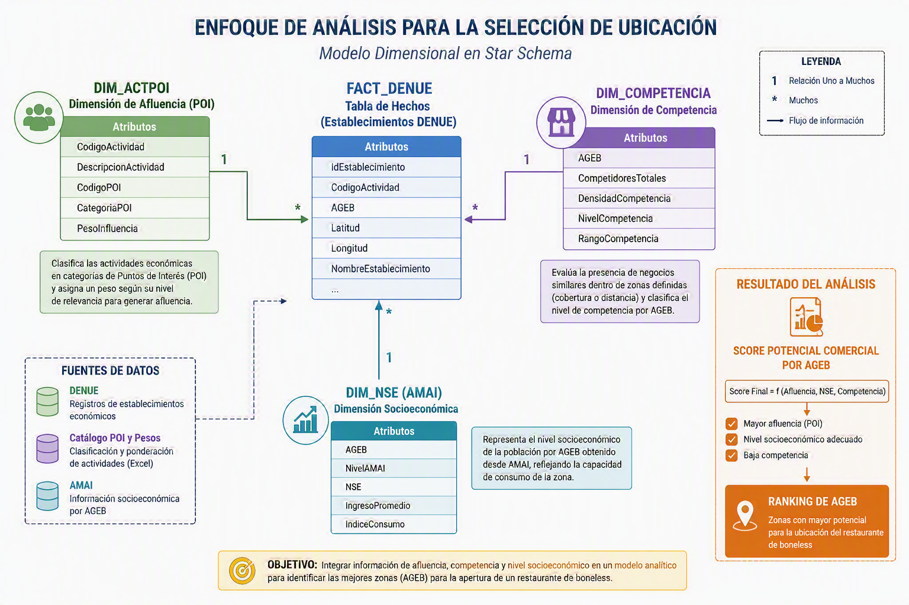

  
Conclusión:
  

El uso combinado de los factores de afluencia, competencia y nivel socioeconómico, soportado por una arquitectura de datos basada en **Star Schema**, permite transformar la selección de ubicación en un proceso objetivo y fundamentado en evidencia. La integración de las dimensiones **DIM_ACTPOI**, **DIM_NSE** y **DIM_COMPETENCIA** proporciona una visión integral del entorno comercial de cada AGEB, permitiendo identificar aquellas zonas con mejores condiciones para la instalación y operación de un restaurante de boneless.

---

## 5. Reglas de Negocio

Las siguientes reglas de negocio establecen los criterios utilizados para identificar las zonas con mayor potencial para la apertura de un restaurante de boneless en el municipio de Monterrey, Nuevo León.

### RN-01: Mercado Objetivo

El análisis se enfocará exclusivamente en AGEB cuyo nivel socioeconómico predominante corresponda a los niveles:

- C
- C+

#### Justificación

El concepto de restaurante de boneless se orienta principalmente a consumidores de nivel socioeconómico medio y medio-alto, segmentos que presentan una capacidad de gasto compatible con el tipo de producto y experiencia ofrecida.

---

### RN-02: Exclusión de AGEB fuera del mercado objetivo

Las AGEB cuya clasificación socioeconómica predominante corresponda a:

- A/B
- D+
- D
- E

serán excluidas del análisis principal.

#### Justificación

Estas zonas no representan el mercado objetivo prioritario definido para el proyecto.

---

### RN-03: Priorización de la afluencia potencial

Las AGEB que presenten una mayor concentración de puntos generadores de afluencia recibirán una puntuación superior dentro del modelo de evaluación.

Se consideran los siguientes generadores de afluencia:
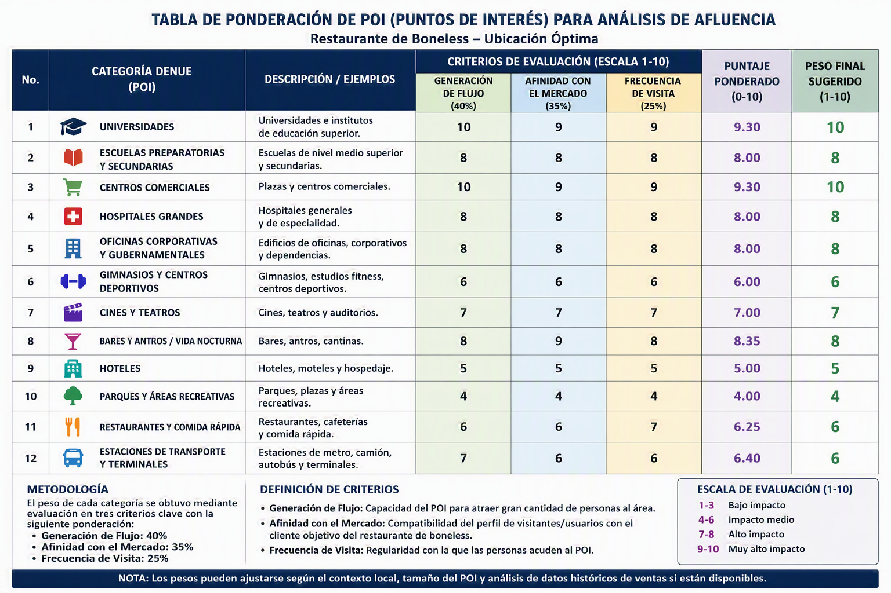

#### Justificación

La presencia de estos establecimientos incrementa la movilidad de personas y el mercado potencial disponible para el restaurante.

---

### RN-04: Penalización por competencia

Las AGEB que presenten una alta concentración de establecimientos similares recibirán una menor puntuación dentro del modelo de evaluación.

Se consideran competidores directos los negocios relacionados con:

- Boneless
- Alitas
- Wings
- Sports Bar
- Conceptos similares

#### Justificación

Una mayor presencia de competidores reduce la participación potencial de mercado y puede afectar la rentabilidad del establecimiento.

---

### RN-05: Evaluación integral de ubicación

La recomendación final de ubicación no dependerá de una única variable, sino de la combinación de:

- Nivel socioeconómico
- Afluencia potencial
- Competencia

#### Justificación

La evaluación conjunta permite reducir el riesgo de seleccionar zonas con alto poder adquisitivo pero baja afluencia, o zonas con alta afluencia pero excesiva competencia.

---

### RN-06: Ranking de zonas potenciales

Las AGEB analizadas serán ordenadas de acuerdo con una puntuación final obtenida a partir de los criterios definidos en el proyecto.

El resultado esperado será un ranking de las zonas con mayor potencial para la apertura de un restaurante de boneless.

#### Justificación

La generación de un ranking facilita la comparación objetiva entre ubicaciones y permite identificar las mejores oportunidades de negocio dentro del municipio de Monterrey.

## 6. ETL de Nivel Socioeconómico (Construcción de DIM_NSE)

Este proceso ETL tiene como objetivo construir la dimensión DIM_NSE, la cual será integrada al modelo dimensional tipo Star Schema utilizado para el análisis de potencial comercial.

---

### 6.1 Fuente de datos

Datos obtenidos de:

https://www.amai.org/NSE/index.php?queVeo=NSEDES  

Basados en:
- INEGI (ENIGH + Censo 2020)  
- Modelos de clasificación socioeconómica  

Nivel de detalle:
- Municipio  
- Localidad  
- AGEB  

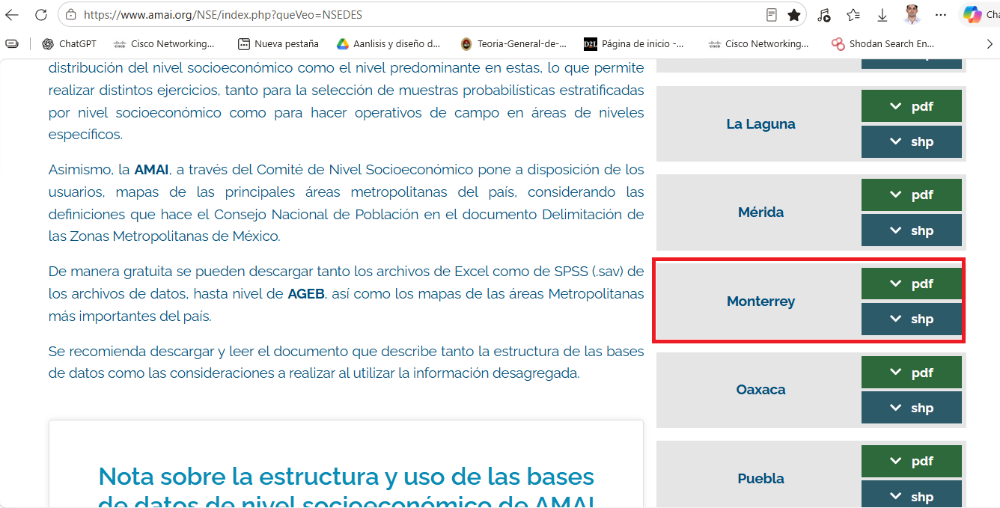

---

### 6.2 Flujo de trabajo (ETL)

#### Extract (Obtención)

Datos descargados en formato Shapefile:

- .shp → geometría  
- .dbf → atributos  
- .shx → índice  

#### Transform (Python)

Se extrajeron los datos del archivo .dbf y se convirtieron a formato CSV utilizando Python.

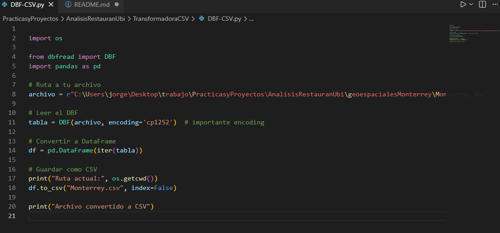

Resultado:
- Conversión de DBF a CSV  
- Preparación de datos para análisis en Power BI  

#### Load (Power BI)

El archivo CSV fue importado en Power BI para su análisis.

#### Transform (Power BI / Power Query)

En Power BI se realizó la limpieza y transformación de datos, incluyendo:

- Eliminación de valores nulos  
- Corrección de tipos de datos  
- Estandarización de nombres  
- Selección de variables relevantes  

Resultado:
- Dataset limpio y estructurado para análisis  

---

### 6.3 Visualización preliminar de NSE en Power BI

Como resultado del proceso de limpieza y transformación de datos, se generaron visualizaciones iniciales para explorar el nivel socioeconómico por municipio.

#### Distribución del nivel socioeconómico por municipio

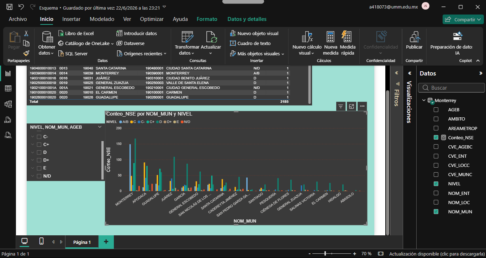

Esta visualización muestra la distribución de los niveles socioeconómicos por municipio, permitiendo identificar las zonas con mayor presencia de niveles medios y altos, lo cual es clave para evaluar el potencial de consumo en el análisis de ubicación del restaurante.

---

### 6.4 Resultado de la transformación

Como resultado del proceso ETL se generó la dimensión DIM_NSE, destinada a representar las características socioeconómicas de cada AGEB dentro del modelo analítico.

#### Estructura conceptual

- AGEB
- Nivel AMAI
- Nivel Socioeconómico (NSE)
- Ingreso Promedio
- Índice de Consumo
- Variables complementarias

La dimensión DIM_NSE se relacionará posteriormente con la tabla de hechos FACT_DENUE mediante el identificador geográfico AGEB, permitiendo incorporar indicadores socioeconómicos al proceso de evaluación de ubicaciones comerciales.

---

## 7. Análisis de Puntos de Interés (ETL)

Este proyecto utiliza información de Puntos de Interés (POI) obtenida del DENUE de INEGI para estimar la afluencia potencial de cada AGEB.

Mediante este proceso ETL se construye la dimensión **DIM_ACTPOI**, integrada al modelo **Star Schema** del proyecto, la cual permite clasificar y ponderar actividades económicas según su capacidad para generar concentración de personas.

> **Nota:** La afluencia corresponde a una estimación basada en la presencia y ponderación de Puntos de Interés (POI), no a una medición directa del flujo peatonal.

---

### 7.1 Fuente de datos

Datos obtenidos de:

https://www.inegi.org.mx/app/mapa/denue/

Fuente oficial:

- Instituto Nacional de Estadística y Geografía (INEGI)
- Directorio Estadístico Nacional de Unidades Económicas (DENUE)

El DENUE proporciona información de establecimientos económicos registrados en México, incluyendo:

- Nombre del establecimiento
- Actividad económica
- Código de actividad económica (SCIAN)
- Ubicación geográfica
- Coordenadas
- Información territorial

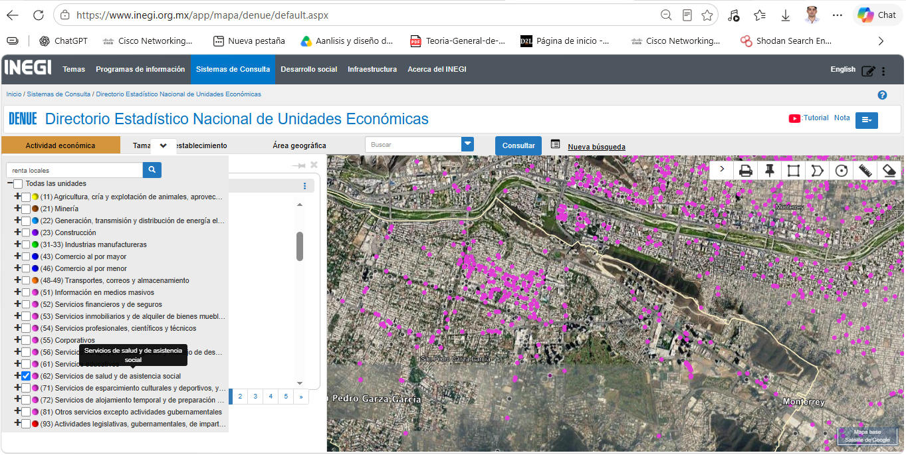

---

### 7.2 Flujo de trabajo (ETL)

#### Extract (Obtención)

Se descargó la base de datos del DENUE correspondiente al área geográfica de estudio.

Las variables utilizadas fueron:

- Nombre del establecimiento
- Código SCIAN
- Descripción de la actividad económica
- Coordenadas geográficas
- Clave AGEB

**Resultado:**

- Base de establecimientos económicos georreferenciados.

---

#### Transform (Construcción de DIM_ACTPOI)

 
Como parte del proceso de transformación de datos para el análisis de afluencia comercial, fue necesario establecer un mecanismo que permitiera clasificar las actividades económicas registradas en el Directorio Estadístico Nacional de Unidades Económicas (DENUE) de acuerdo con su capacidad potencial para generar flujo de personas. Para ello, se adoptó una metodología basada en un **modelo dimensional tipo estrella**, cuyo objetivo es facilitar el análisis y la agregación de información dentro del entorno de inteligencia de negocios.

 
En una primera etapa, se elaboró un catálogo de actividades económicas en Microsoft Excel, utilizando como insumo los códigos de actividad económica presentes en los registros del DENUE. Cada actividad fue analizada y clasificada de acuerdo con su relevancia para la generación de afluencia comercial en el contexto del estudio. Como resultado, se asignó un **Código POI (Point of Interest)** que representa la categoría funcional a la que pertenece cada actividad económica.

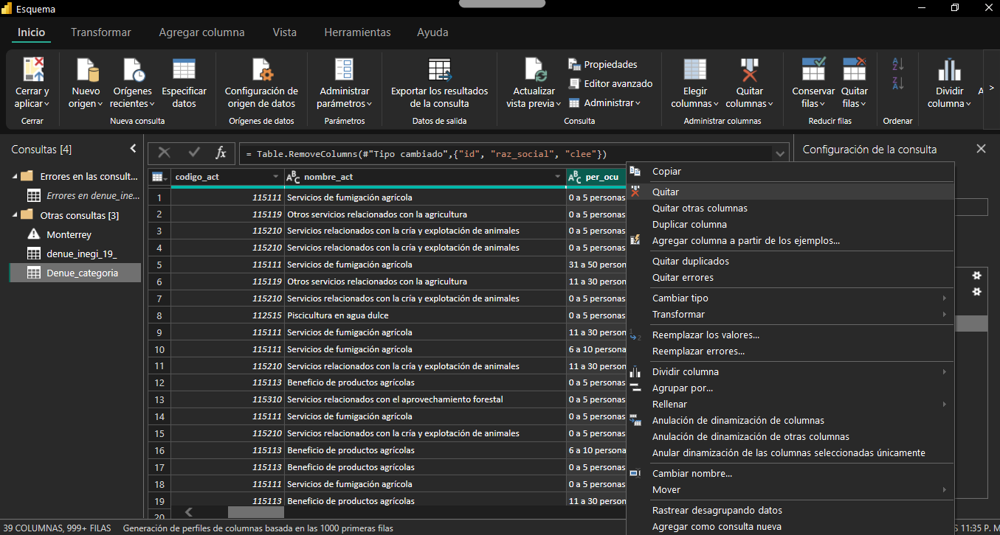
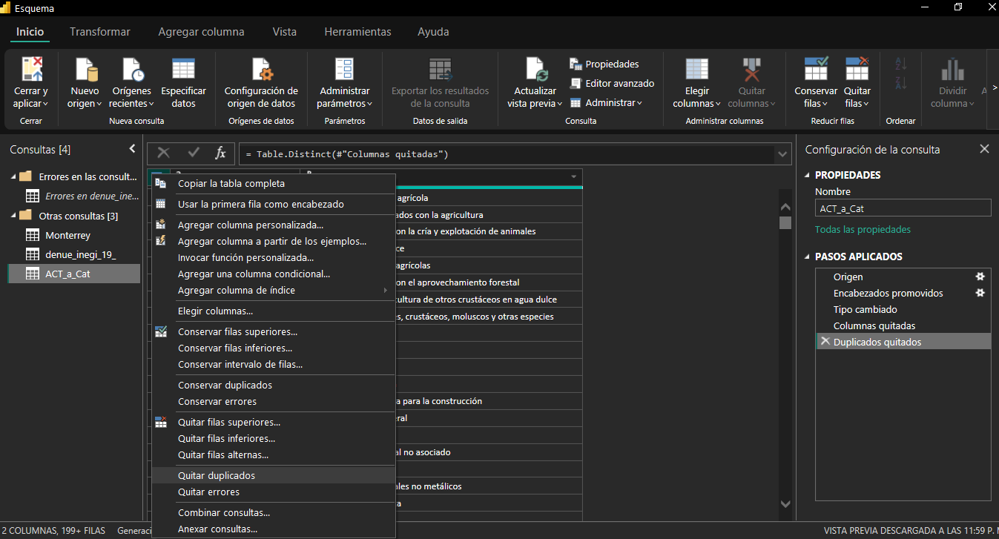
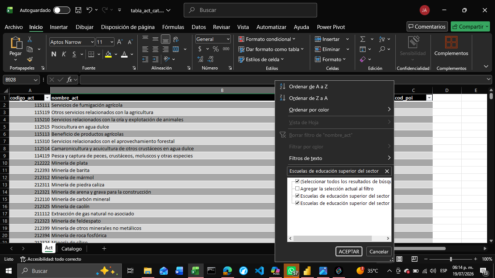
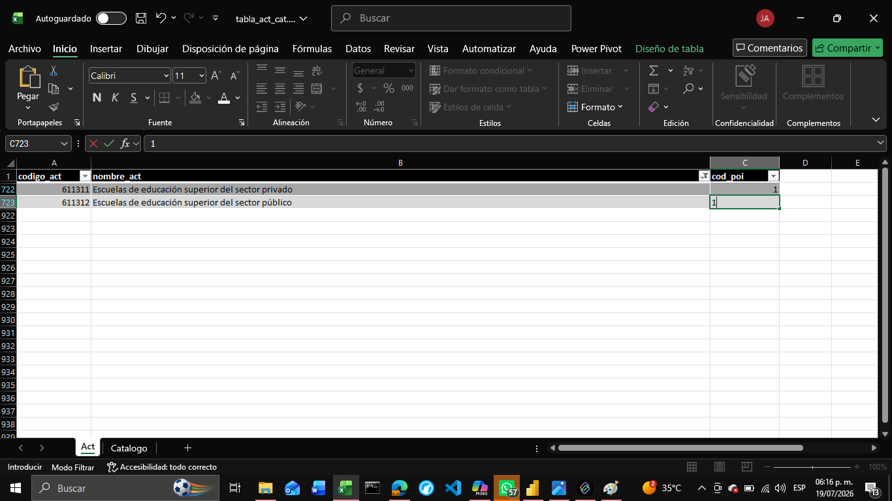
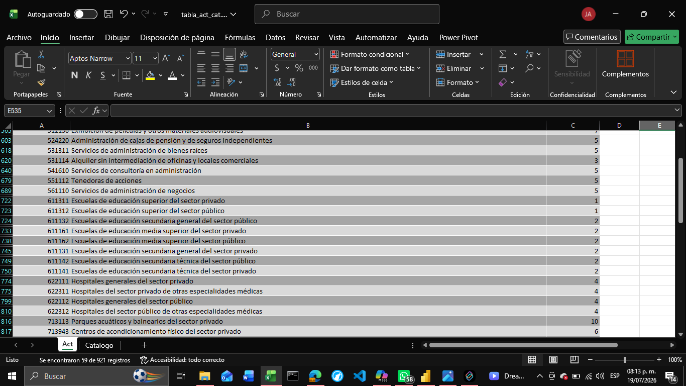
 
Posteriormente, se desarrolló un catálogo independiente de categorías POI, el cual contiene la clasificación de los puntos de interés identificados, así como el peso o nivel de influencia asignado a cada categoría. Dichos pesos fueron definidos conforme a las reglas de negocio establecidas para el proyecto y representan la importancia relativa de cada tipo de establecimiento como generador potencial de demanda comercial.

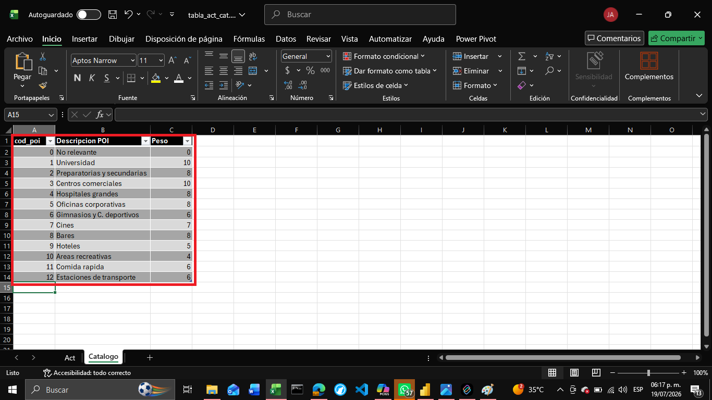
 
Una vez definidos ambos catálogos, se procedió a realizar el proceso de homologación de datos mediante **Power Query**, utilizando el Código POI como llave de relación. A través de una operación de combinación de consultas (*Merge Queries*), se integró la información de clasificación y ponderación dentro de una única estructura dimensional.

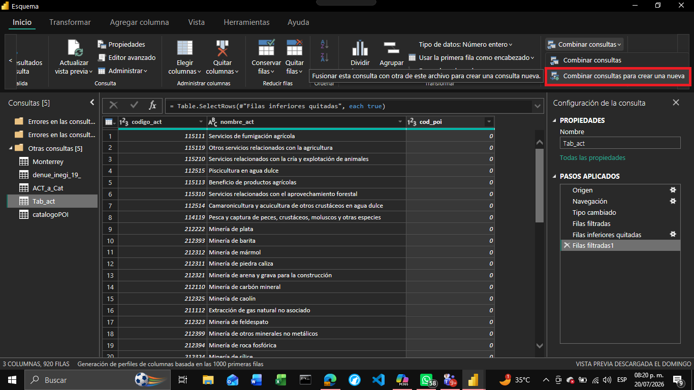
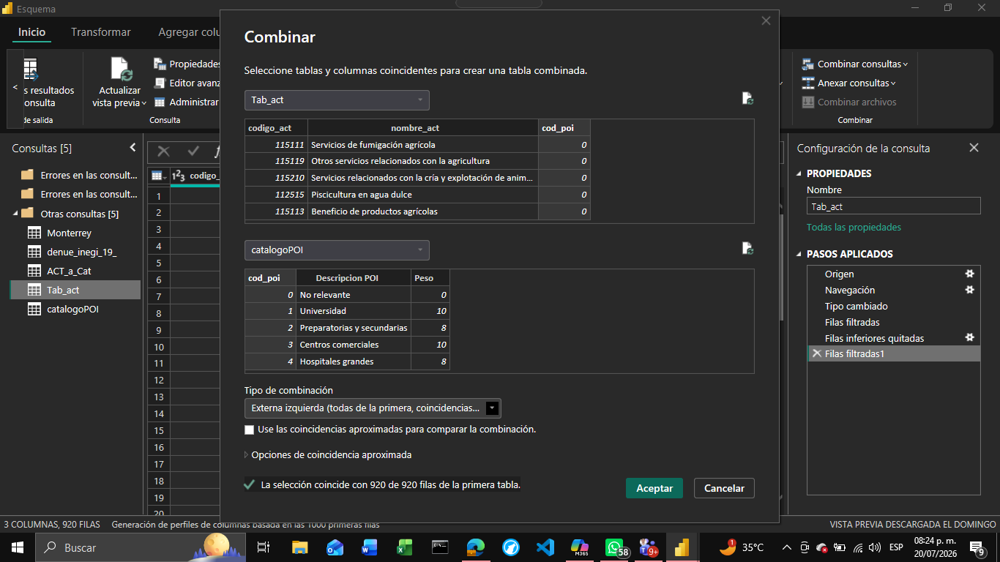
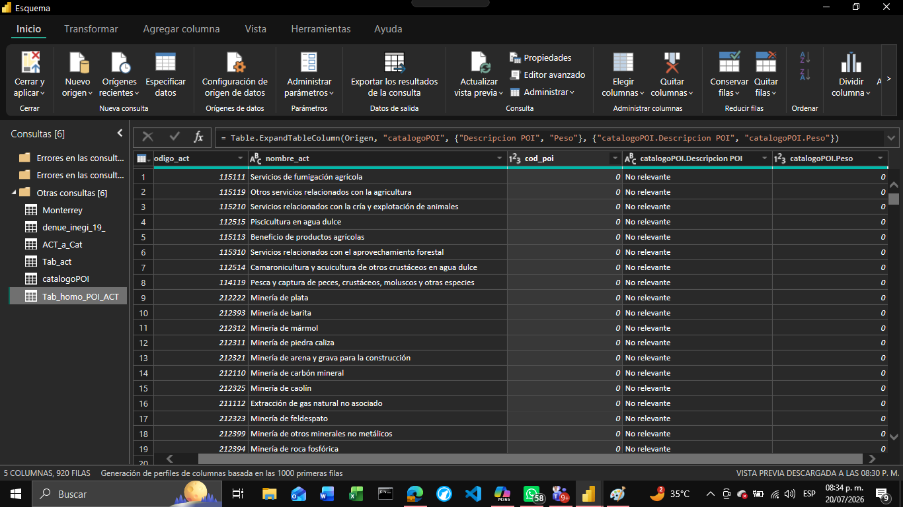
 
Como resultado de este proceso se generó la dimensión **DIM_ACTPOI**, la cual concentra la información necesaria para clasificar y ponderar las actividades económicas dentro del modelo analítico.

### Estructura conceptual de DIM_ACTPOI

Como resultado del proceso de homologación se generó la dimensión DIM_ACTPOI, diseñada para almacenar la clasificación de las actividades económicas y sus respectivos factores de ponderación.

La estructura conceptual de la dimensión está compuesta por los siguientes atributos:

- Código de Actividad Económica.
- Descripción de la Actividad.
- Código POI.
- Categoría POI.
- Peso de Influencia.

La dimensión permite centralizar las reglas de clasificación y ponderación utilizadas para el cálculo del Score de Afluencia, evitando la duplicidad de información dentro de la tabla de hechos.

⚙️🔧 **Proyecto en construcción:** El desarrollo de este proyecto continúa en progreso y algunas funcionalidades, análisis y visualizaciones aún se encuentran en implementación.
